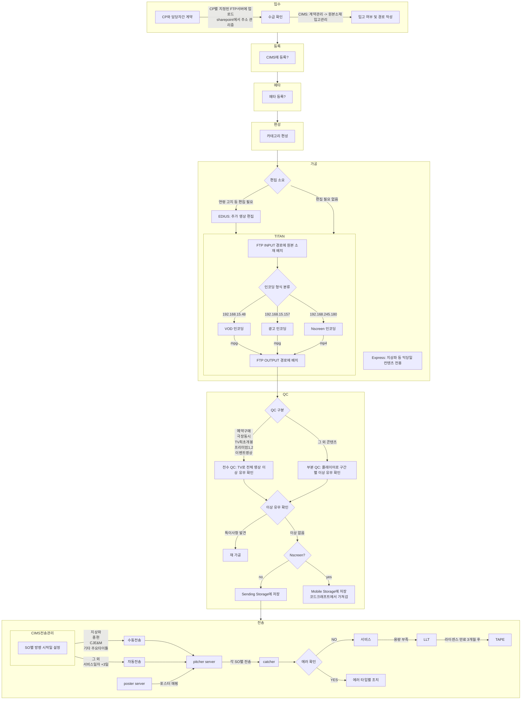

## 입수

입수 단계에서 할 일 : FTP 확인하여 CIMS '원본소재 입고관리'에 체크하면 끝?

입고 예정 리스트는 어디서 확인?

입고 예정인 콘텐츠가 FTP에 없으면? 누구에게 문의?

-   FTP 관리 쉐어포인트 : https://hchoice.sharepoint.com/:x:/g/media/EfotpDdXZNZGreAw8azqgYABtUwg4YR4gztkZwnxX0M-eQ?rtime=rSZc3ahU3Ug

## 등록, 메타, 편성 (콘사 작업 영역)

포스터, 메타의 출처?

각 단계별 파일 누락 및 오류 시 누구에게 문의?

각 파일의 상세 경로?

## 가공

가공 단계에서 할 일 : EDIUS 편집, INPUT 경로에 원본 소재 배치, 인코딩 결과물 OUTPUT 경로에 배치, 파일명 변경

EDIUS 편집 필요 기준?

EDIUS 편집은 수동 or 자동?

인코딩 과정에서 오류 시 처리?

동시 작업 가능 수

-   8대 가동중
-   1대당 2개씩 작업

가공 완료된 영상은 수동으로 파일명 변경해야함

익당일 콘텐츠(express)의 입고 여부 확인 방법? 없을 땐 어디에 문의?

TITAN 원격 접속(Anydesk) : Administrator // dnsdudtlf15^ (운영실15^)

## QC

QC 단계에서 할 일 : 영상 검수하여 CIMS에서 체크하면 끝?

검수 사항: 오디오 싱크, 화면 깨짐, 음모 노출, 오디오 이슈, 메타 줄거리와 영상 내용

코드크래프트에서 영상을 가져갔는지 여부? 가져간 이후 파일 처리?

## 전송

전송 단계에서 할 일 : 자동 전송 결과 확인(에러 시 조치), 수동 전송

각 에러 시 조치 방법?

자동 전송 대상 콘텐츠를 수동으로 전송하고 싶으면? +할 경우가 생기는지?

포스터 및 메타가 없으면?(매핑에 실패하면)

-   관제 서버 접속(Microsoft Remote Desktop) : 192.168.20.240 // administrator // dksckd3!&

-   AS 게시판 링크 : https://cs.cablevod.co.kr/
-   AS 게시판 계정 :
